# nano-symphony Local Loop Quick Start

## Overview

nano-symphony is a lightweight orchestration service that combines a local Bun/TypeScript backend with SQLite, an MCP server, and real nano-agent subprocesses running in sandboxes (sandbox-exec on macOS, bwrap on Linux). The core loop is:

```
tick → claim issue → spawn agent → collect sentinel/MCP → update state machine
```

This skill provides the shortest path from zero to seeing a complete agent run finish successfully, plus a troubleshooting guide for common blockers.

**Not in scope:** Remote deployment, frontend dashboard customization, custom MCP tool development, production-grade sandbox tuning.

## Prerequisites

- **Bun ≥ 1.x** — Verify with `bun --version`
- **Real nano binary** — Either on `PATH` or set explicitly via `NANO_BIN=/absolute/path/nano`
- **macOS** (default: sandbox-exec) or **Linux** (default: bwrap)

## Quick Start

Follow this sequence to run a minimal demo from scratch:

### 1. Clone and Initialize

```bash
git clone https://github.com/nano-harness/nano-symphony.git
cd nano-symphony
./scripts/init-project.sh
# This creates .env from .env.example and runs bun install
```

### 2. Create Workflow Configuration

```bash
cp templates/WORKFLOW.example.md WORKFLOW.md
```

The example workflow already has sensible defaults:
- `agent.binary: nano`
- `agent.timeout_ms: 300000` (5 minutes)
- `agent.max_retries: 3`
- `agent.sandbox.backend: native` (sandbox-exec on macOS, bwrap on Linux)
- `agent.sandbox.network_access: true` (required for MCP callbacks)

### 3. Start the Service

```bash
bun run start
```

By default, the service listens on **port 4123** and starts the orchestrator loop. You should see log lines indicating:
- HTTP server started
- MCP server mounted at `/mcp`
- Orchestrator tick started

For more verbose logging during development:

```bash
LOG_LEVEL=debug bun run start
```

### 4. Create a Demo Issue

**Critical:** Use `state: "todo"` or `state: "in_progress"`, NOT `state: "backlog"`. The orchestrator's candidate SQL filters out backlog issues by default.

```bash
curl -X POST http://localhost:4123/api/v1/issues \
  -H 'Content-Type: application/json' \
  -d '{
    "identifier": "DEMO-1",
    "title": "echo hello world",
    "description": "Print hello world and exit successfully",
    "priority": "medium",
    "state": "todo"
  }'
```

The orchestrator will pick up this issue within the next tick (default: 5 seconds, see `ORCHESTRATOR_TICK_MS`).

### 5. Observe Events

Fetch the event timeline to see progress:

```bash
curl -s http://localhost:4123/api/v1/events | jq '.[] | {ts, kind, message}'
```

Expected event sequence:
1. `started` — Orchestrator claimed the issue
2. `goal_state_observed` — Agent reported goal state (if using goal evaluator)
3. `sandbox_observed` — Sandbox metadata recorded
4. `session_completed` — Agent called `symphony.session_completed` MCP tool (if instrumented)
5. `completed` / `handoff` / `abandoned` — Final state based on agent outcome

Alternatively, stream events in real-time via SSE:

```bash
curl -N http://localhost:4123/api/v1/events/stream
```

### 6. Check Agent Logs

Agent stdout/stderr is captured in the workspace:

```bash
ls workspaces/DEMO-1/logs/
tail -50 workspaces/DEMO-1/logs/attempt-0.log
```

Look for the sentinel line at the end:

```
<< SENTINEL: {"status":"success","goal_state":{"condition":"...","achieved_at":"2026-05-17T07:50:00.000Z"}}
```

### 7. Verify Final State

```bash
curl -s http://localhost:4123/api/v1/issues/$(curl -s http://localhost:4123/api/v1/issues | jq -r '.[0].id') | jq '{state, updated_at}'
```

The issue should transition to `done`, `in_review`, or `cancelled` based on your workflow's `state_transitions` config (default: `success → done`, `abandoned → cancelled`, `handoff → in_review`).

## Architecture at a Glance

```mermaid
graph LR
    A[HTTP POST /issues] --> B[SQLite: issues table]
    B --> C[Orchestrator tick]
    C --> D{getCandidates}
    D -->|state NOT IN backlog/done/cancelled| E[claimIssue]
    E --> F[ensureWorkspace]
    F --> G[renderPrompt]
    G --> H[issueToken]
    H --> I[spawnAgent: nano binary exec --sandbox=on]
    I --> J[Agent runs in sandbox]
    J --> K{Completion signals}
    K -->|1. MCP session_completed| L[deriveCompletion]
    K -->|2. stdout sentinel| L
    K -->|3. exit code| L
    L --> M[State machine update]
    M --> N[releaseIssue]
```



## WORKFLOW.md Key Fields Reference

| Section | Field | Default | Description |
|---------|-------|---------|-------------|
| `tracker` | `type` | `local` | Tracker backend (only `local` supported now) |
| `agent` | `binary` | `nano` | Path or name of agent executable |
| `agent` | `timeout_ms` | `300000` | Max runtime before kill (5 min) |
| `agent` | `max_retries` | `3` | Max retry attempts before giving up |
| `agent.sandbox` | `backend` | `native` | `native` (sandbox-exec/bwrap), `docker`, or `none` |
| `agent.sandbox` | `network_access` | `true` | Allow agent shells to make network requests |
| `agent.sandbox` | `extra_read_only_paths` | `[]` | Additional paths agent can read |
| `agent.sandbox` | `extra_writable_paths` | `[]` | Additional paths agent can write |
| `agent.sandbox` | `docker_image` | `ubuntu:24.04` | Docker image (only when `backend: docker`) |
| `agent.sandbox` | `docker_runtime` | (optional) | gVisor (`runsc`) or Kata for stronger isolation |
| `goal` | `condition` | (required) | Natural language goal description |
| `goal` | `max_turns` | `50` | Max agent turns before abort |
| `goal` | `inject_mode` | `prefix` | How to inject goal: `prefix`, `system`, `none` |
| `goal` | `abort_on_max_turns` | `true` | Whether to abandon on max turns |
| `retry` | `base_delay_ms` | `5000` | Initial backoff delay |
| `retry` | `max_delay_ms` | `300000` | Max backoff delay |
| `state_transitions` | `success` | `done` | Target state on success (null = no transition) |
| `state_transitions` | `abandoned` | `cancelled` | Target state on abandoned |
| `state_transitions` | `handoff` | `in_review` | Target state on handoff |
| `state_transitions` | `needs_retry` | `null` | Target state on retry (null = stay in current) |

## Minimal Demo (macOS arm64 + native sandbox)

Here's a complete copy-paste sequence verified on macOS:

```bash
# 0. Prerequisites
cd nano-symphony
./scripts/init-project.sh
cp templates/WORKFLOW.example.md WORKFLOW.md
command -v nano && nano --version  # Must see real nano binary

# 1. Start service in background
LOG_LEVEL=debug bun run start > /tmp/symphony.out 2>&1 &
SYM_PID=$!
sleep 3

# 2. Verify service is up
curl -fsS http://localhost:4123/api/v1/runs
# Expected: []

# 3. Create a todo issue (NOT backlog)
curl -X POST http://localhost:4123/api/v1/issues \
  -H 'Content-Type: application/json' \
  -d '{
    "identifier": "DEMO-1",
    "title": "echo hello",
    "description": "Just say hi and exit",
    "priority": "medium",
    "state": "todo"
  }'

# 4. Wait for orchestrator tick + agent run
sleep 10

# 5. Check events
curl -s http://localhost:4123/api/v1/events | jq -r '.[] | "\(.ts) \(.kind) \(.message)"'

# 6. Check logs
ls workspaces/DEMO-1/logs/
tail -50 workspaces/DEMO-1/logs/attempt-0.log

# 7. Verify final state
curl -s http://localhost:4123/api/v1/issues | jq -r '.[0] | {identifier, state, updated_at}'

# 8. Cleanup
kill $SYM_PID
```

**Pass criteria:**
1. Events include `started` → `goal_state_observed` or `sandbox_observed` → `session_completed` or `completed`
2. `attempt-0.log` contains nano output and ends with `<< SENTINEL:` line (or records exit code)
3. Issue state transitioned from `todo` to `done`/`in_review`/`cancelled` (not stuck in `todo`)

## Verification & Observation

### Check Active Runs

```bash
curl -s http://localhost:4123/api/v1/runs | jq
```

Returns array of `{issue_id, next_attempt, last_state, workspace_path, workspace_managed, ...}` for in-flight work. The `workspace_managed` field indicates whether symphony manages the workspace lifecycle (`true`) or if it's an external user-provided path (`false`).

### Stream Events (SSE)

```bash
curl -N http://localhost:4123/api/v1/events/stream
```

### Query Specific Issue

```bash
curl -s http://localhost:4123/api/v1/issues/<ISSUE_ID> | jq
```

### Read Agent Logs

For managed workspaces, logs are stored at `workspaces/<identifier>/logs/attempt-N.log`. For external workspaces (when `workspace_path` is specified), logs are in `<workspace_path>/logs/attempt-N.log`. Attempt numbering starts from 0.

```bash
# Managed workspace:
tail -100 workspaces/DEMO-1/logs/attempt-0.log

# External workspace (check workspace_path from runs API):
tail -100 /path/to/external/workspace/logs/attempt-0.log
```

## Troubleshooting

| Symptom | Root Cause | Fix |
|---------|-----------|------|
| Issue created but never gets `started` event | `state=backlog` is filtered by candidate SQL | Create with `state: "todo"` or `state: "in_progress"` |
| `started` event, then immediate `abandoned`, exit code not 0/10/20/30 | Binary not found or sandbox denial | Check `attempt-N.log` for error; verify `nano` is on PATH or set `NANO_BIN` |
| No `session_completed`, only `goal_state_observed` | Agent didn't call MCP tool, fell back to sentinel | Normal if agent uses sentinel; check `deriveCompletion` tier-2 logic |
| Stuck in `retry_queued`, never re-runs | `next_due_ts` not reached yet, or exceeded `max_retries` | Query `symphony_runs` table: `SELECT * FROM symphony_runs WHERE issue_id='...'` |
| sandbox-exec error: "Operation not permitted" writing path | Default sandbox only allows writes to workspace + `/tmp` | Add path to `agent.sandbox.extra_writable_paths` in WORKFLOW.md |
| MCP callback returns 401/403 | `SYMPHONY_TOKEN` not passed or expired | Check `.nano.yaml` has `headers.X-Symphony-Token: "${env:SYMPHONY_TOKEN}"` and `MCP_TOKEN_TTL_MS` |
| Agent logs show "MCP server not reachable" | Network blocked by sandbox or wrong URL | Verify `agent.sandbox.network_access: true` and service is running |
| Multiple retries but same error | Retry logic is exponential backoff; state not changing | Check `retry.base_delay_ms` and `retry.max_delay_ms`; consider `state_transitions.needs_retry` |
| Issue stuck in `in_progress` after agent success | `state_transitions.success` set to `null` | Set to `"done"` or desired target state |
| `tail -f` on logs shows nothing | Wrong attempt number or issue not started yet | Attempts start at 0; verify issue was claimed with `GET /runs` |

## Common Mistakes

1. **Creating issues with `state: "backlog"` and expecting auto-run**
   ❌ Backlog issues are NOT picked by `getCandidates` SQL.
   ✅ Use `state: "todo"` or call `symphony.activate_issue` to move out of backlog.

2. **Assuming any binary works without `binary exec --sandbox=on` support**
   ❌ Older nano versions or non-nano binaries will silently fail or ignore sandbox.
   ✅ Verify your binary supports the sandbox subcommand: `nano binary exec --help`.

3. **Disabling sandbox (`backend: none`) for "quick debugging"**
   ❌ Agents gain access to host secrets, SSH keys, and sensitive env vars.
   ✅ Use `backend: native` even in dev; only disable for controlled experiments.

4. **Setting `state_transitions.success: null` and wondering why issues never reach `done`**
   ❌ `null` means "no transition", so issue stays in current state forever.
   ✅ Set to `"done"` or another terminal state.

5. **Using `tail -f` with wrong attempt number**
   ❌ Attempts are 0-indexed; `tail -f attempt-1.log` when only attempt-0 ran shows nothing.
   ✅ Check `ls workspaces/<identifier>/logs/` first to see which attempts exist.

6. **Expecting real-time logs without using SSE or polling**
   ❌ Agent logs are written to disk; `GET /events` is a snapshot.
   ✅ Use `GET /events/stream` (SSE) or `GET /logs/:issueId/:attempt` (SSE) for streaming.

7. **Not checking sentinel format when debugging completion logic**
   ❌ Sentinel must be valid JSON prefixed with `<< SENTINEL:`.
   ✅ Use `grep '<< SENTINEL:' attempt-0.log` to verify format.

8. **Forgetting to restart service after editing WORKFLOW.md**
   ❌ In-memory workflow cache doesn't reload automatically.
   ✅ Restart `bun run start` or use the frontend workflow editor (auto-reloads on save).

## See Also

- [skills/nano-symphony/SKILL.md](../nano-symphony/SKILL.md) — Agent behavior contract inside Symphony workspaces (MCP tool usage)
- [README.md](../../README.md) — Full HTTP API reference, sandbox details, configuration options
- [templates/WORKFLOW.example.md](../../templates/WORKFLOW.example.md) — Starter workflow with comments
