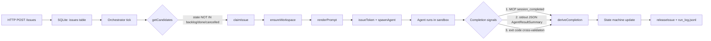

# nano-symphony Local Loop Quick Start

## Overview

nano-symphony is a lightweight orchestration service that combines a local Bun/TypeScript backend with SQLite, an MCP server, and real agent subprocesses (nano or claude-code) running in sandboxes. The core loop is:

```
tick → claim issue → spawn agent → collect stdout JSON + MCP events → update state machine
```

This skill provides the shortest path from zero to seeing a complete agent run finish successfully, plus a troubleshooting guide for common blockers.

**Not in scope:** Remote deployment, frontend dashboard customization, custom MCP tool development, production-grade sandbox tuning.

## Prerequisites

- **Bun >= 1.x** — Verify with `bun --version`
- **Real nano binary** — Either on `PATH` or set explicitly via `NANO_BIN=/absolute/path/nano`
- **macOS** (default: sandbox-exec) or **Linux** (default: bwrap)
- For claude-code agent: `claude` CLI installed and authenticated

## Quick Start

Follow this sequence to run a minimal demo from scratch:

### 1. Clone and Initialize

```bash
git clone https://github.com/nano-harness/nano-symphony.git
cd nano-symphony
./scripts/init-project.sh
# This creates .env from .env.example and runs bun install
```

### 2. Create Workflow Configuration

```bash
cp templates/WORKFLOW.example.md WORKFLOW.md
```

The example workflow already has sensible defaults:
- `agent.binary: nano`
- `agent.timeout_ms: 300000` (5 minutes)
- `agent.max_retries: 3`
- `agent.sandbox.backend: native` (sandbox-exec on macOS, bwrap on Linux)
- `agent.sandbox.network_access: true` (required for MCP callbacks)

### 3. Start the Service

```bash
bun run start
```

By default, the service listens on **port 4123** and starts the orchestrator loop. You should see log lines indicating:
- HTTP server started
- MCP server mounted at `/mcp`
- Orchestrator tick started

For more verbose logging during development:

```bash
LOG_LEVEL=debug bun run start
```

### 4. Export API Token

All `/api/v1/*` endpoints (except `/api/v1/health`) require authentication. Export the token from `.env` once and reuse it for every `curl` command below:

```bash
TOKEN=$(grep '^API_TOKEN=' .env | cut -d= -f2-)
```

The token was generated automatically by `init-project.sh`. To view it at any time: `grep API_TOKEN .env`.

### 5. Create a Demo Issue

**Critical:** Use `state: "todo"` or `state: "in_progress"`, NOT `state: "backlog"`. The orchestrator's candidate SQL filters out backlog issues by default.

```bash
curl -X POST http://localhost:4123/api/v1/issues \
  -H "X-Symphony-Token: ${TOKEN}" \
  -H 'Content-Type: application/json' \
  -d '{
    "identifier": "DEMO-1",
    "title": "echo hello world",
    "description": "Print hello world and exit successfully",
    "priority": "medium",
    "state": "todo"
  }'
```

The orchestrator will pick up this issue within the next tick (default: 5 seconds, see `ORCHESTRATOR_TICK_MS`).

### 6. Observe Events

Fetch the event timeline to see progress:

```bash
curl -s -H "X-Symphony-Token: ${TOKEN}" http://localhost:4123/api/v1/events | jq '.[] | {ts, kind, message}'
```

Expected event sequence:
1. `started` — Orchestrator claimed the issue and spawned agent
2. `goal_state_observed` — Agent reported goal state (if using goal evaluator)
3. `sandbox_observed` — Sandbox metadata recorded
4. `session_completed` — Agent called `symphony.session_completed` MCP tool
5. `completed` / `handoff` / `abandoned` — Final state based on agent outcome

Alternatively, stream events in real-time via SSE:

```bash
curl -N -H "X-Symphony-Token: ${TOKEN}" http://localhost:4123/api/v1/events/stream
```

### 7. Check Agent Logs

Agent stdout/stderr is captured in the workspace:

```bash
ls workspaces/DEMO-1/logs/
tail -50 workspaces/DEMO-1/logs/attempt-0.log
```

The result is the last JSON line in stdout matching the `AgentResultSummary` schema:

```json
{"status":"success","reason":"task completed","goal_state":{"last_reason":"hello world printed"},"tokens":{"input":1200,"output":350}}
```

### 8. Verify Final State

```bash
curl -s -H "X-Symphony-Token: ${TOKEN}" http://localhost:4123/api/v1/issues/$(curl -s -H "X-Symphony-Token: ${TOKEN}" http://localhost:4123/api/v1/issues | jq -r '.[0].id') | jq '{state, updated_at}'
```

The issue should transition to `done`, `in_review`, or `cancelled` based on your workflow's `state_transitions` config (default: `success -> done`, `abandoned -> cancelled`, `handoff -> in_review`).

### 9. Check Health

```bash
curl -s http://localhost:4123/api/v1/health | jq
```

Returns orchestrator status, inflight agents count, queue depth, and uptime.

## Architecture at a Glance



**Completion signal priority:** MCP `session_completed` semantics override stdout payload; exit code is used for cross-validation (success + non-zero exit = downgrade to needs_retry).

**Output directory:** Agent artifacts are written to `<workspace>/.nano-out/` (contains `result.json` and `solution.patch` for nano agent).

## Claude Code Agent

To use Claude Code instead of nano:

```bash
curl -X POST http://localhost:4123/api/v1/issues \
  -H "X-Symphony-Token: ${TOKEN}" \
  -H 'Content-Type: application/json' \
  -d '{
    "identifier": "DEMO-2",
    "title": "add a hello function",
    "description": "Add a hello() function to main.ts",
    "priority": "medium",
    "state": "todo",
    "agent_kind": "claude-code"
  }'
```

Key differences:
- Uses `claude -p --output-format stream-json` instead of `nano binary exec`
- Token usage extracted from envelope-level `usage` field (authoritative, not self-reported)
- Does NOT produce `solution.patch` — use `collectWorkspaceDiff` for diff
- Permission mode is `acceptEdits` by default
- MCP config written to `.mcp.json` (not `.nano/nano.yaml`)

## Operator Workflow

### Adding comments during a run

```bash
curl -X POST http://localhost:4123/api/v1/issues/<ID>/comments \
  -H "X-Symphony-Token: ${TOKEN}" \
  -H 'Content-Type: application/json' \
  -d '{"body": "Focus on the edge case where input is empty", "author": "alice"}'
```

Comments are injected into the next attempt's prompt automatically.

### Cancelling a running agent

```bash
curl -X POST -H "X-Symphony-Token: ${TOKEN}" http://localhost:4123/api/v1/runs/<ISSUE_ID>/cancel
```

Sends SIGTERM to the agent process, then SIGKILL after 3 seconds.

### Requesting changes after handoff

```bash
curl -X POST http://localhost:4123/api/v1/issues/<ID>/request-changes \
  -H "X-Symphony-Token: ${TOKEN}" \
  -H 'Content-Type: application/json' \
  -d '{"note": "Tests are failing, please fix the edge case"}'
```

Reverts issue to `todo` and injects the note into next attempt's prompt.

### Retriggering a completed/abandoned issue

```bash
curl -X POST http://localhost:4123/api/v1/issues/<ID>/retrigger \
  -H "X-Symphony-Token: ${TOKEN}" \
  -H 'Content-Type: application/json' \
  -d '{"target_state": "todo", "reset_blocker_fingerprint": true, "note": "Try again with updated context"}'
```

### Approving a handoff

```bash
curl -X POST http://localhost:4123/api/v1/issues/<ID>/approve \
  -H "X-Symphony-Token: ${TOKEN}" \
  -H 'Content-Type: application/json' \
  -d '{"note": "Looks good, merging"}'
```

## Run Log

Every completed worker run appends a structured JSON line to `run_log.jsonl`:

```json
{"schema_version":1,"issue_id":"abc","identifier":"DEMO-1","attempt":0,"started_at":"...","finished_at":"...","duration_ms":12000,"semantics":"success","target_state":"done","success":true,"blocker_fingerprint":null,"termination_cause":null,"tokens":{"input":5000,"output":1200,"total":6200},"events_url":"/api/v1/issues/abc/events"}
```

Useful for batch analysis of agent performance, cost tracking, and debugging.

## WORKFLOW.md Key Fields Reference

| Section | Field | Default | Description |
|---------|-------|---------|-------------|
| `agent` | `kind` | `nano` | Agent kind: `nano` or `claude-code` |
| `agent` | `binary` | `nano` | Path or name of agent executable |
| `agent` | `timeout_ms` | `3600000` | Max runtime before kill (1 hour) |
| `agent` | `max_retries` | `3` | Max retry attempts before giving up |
| `agent` | `permission_mode` | `auto` | Permission mode: `default`, `acceptEdits`, `plan`, `auto`, `yolo` |
| `agent.sandbox` | `backend` | `native` | `native` (sandbox-exec/bwrap), `docker`, or `none` |
| `agent.sandbox` | `network_access` | `true` | Allow agent shells to make network requests |
| `agent.sandbox` | `extra_read_only_paths` | `[]` | Additional paths agent can read |
| `agent.sandbox` | `extra_writable_paths` | `[]` | Additional paths agent can write |
| `agent.sandbox` | `extra_denied_paths` | `[]` | Paths explicitly denied |
| `goal` | `condition` | (required) | Natural language goal description |
| `goal` | `max_turns` | `50` | Max agent turns before abort |
| `goal` | `inject_mode` | `prefix` | How to inject goal: `prefix`, `system`, `none` |
| `retry` | `base_delay_ms` | `5000` | Initial backoff delay |
| `retry` | `max_delay_ms` | `300000` | Max backoff delay |
| `state_transitions` | `success` | `done` | Target state on success |
| `state_transitions` | `abandoned` | `cancelled` | Target state on abandoned |
| `state_transitions` | `handoff` | `in_review` | Target state on handoff |

## Minimal Demo (macOS arm64 + native sandbox)

Here's a complete copy-paste sequence verified on macOS:

```bash
# 0. Prerequisites
cd nano-symphony
./scripts/init-project.sh
cp templates/WORKFLOW.example.md WORKFLOW.md
command -v nano && nano --version  # Must see real nano binary

# 1. Start service in background
LOG_LEVEL=debug bun run start > /tmp/symphony.out 2>&1 &
SYM_PID=$!
sleep 3

# 2. Verify service is up (/health is auth-exempt)
curl -fsS http://localhost:4123/api/v1/health | jq '.status'
# Expected: "ok"

# 2.5. Export API token for authenticated requests
TOKEN=$(grep '^API_TOKEN=' .env | cut -d= -f2-)

# 3. Create a todo issue (NOT backlog)
curl -X POST http://localhost:4123/api/v1/issues \
  -H "X-Symphony-Token: ${TOKEN}" \
  -H 'Content-Type: application/json' \
  -d '{
    "identifier": "DEMO-1",
    "title": "echo hello",
    "description": "Just say hi and exit",
    "priority": "medium",
    "state": "todo"
  }'

# 4. Wait for orchestrator tick + agent run
sleep 10

# 5. Check events
curl -s -H "X-Symphony-Token: ${TOKEN}" http://localhost:4123/api/v1/events | jq -r '.[] | "\(.ts) \(.kind) \(.message)"'

# 6. Check logs
ls workspaces/DEMO-1/logs/
tail -50 workspaces/DEMO-1/logs/attempt-0.log

# 7. Verify final state
curl -s -H "X-Symphony-Token: ${TOKEN}" http://localhost:4123/api/v1/issues | jq -r '.[0] | {identifier, state, updated_at}'

# 8. Check run log
tail -1 run_log.jsonl | jq

# 9. Cleanup
kill $SYM_PID
```

**Pass criteria:**
1. Events include `started` -> `session_completed` or `completed`
2. `attempt-0.log` contains agent output ending with an AgentResultSummary JSON line
3. Issue state transitioned from `todo` to `done`/`in_review`/`cancelled` (not stuck in `todo`)
4. `run_log.jsonl` has a line with `"success": true` and non-null `tokens`

## Verification & Observation

### Check Active Runs

```bash
curl -s -H "X-Symphony-Token: ${TOKEN}" http://localhost:4123/api/v1/runs | jq
```

### Stream Events (SSE)

```bash
curl -N -H "X-Symphony-Token: ${TOKEN}" http://localhost:4123/api/v1/events/stream
```

### Stream Agent Logs (SSE)

```bash
curl -N -H "X-Symphony-Token: ${TOKEN}" http://localhost:4123/api/v1/logs/<ISSUE_ID>/current
```

### Query Specific Issue

```bash
curl -s -H "X-Symphony-Token: ${TOKEN}" http://localhost:4123/api/v1/issues/<ISSUE_ID> | jq
```

## Troubleshooting

| Symptom | Root Cause | Fix |
|---------|-----------|------|
| `{"error":"Unauthorized"}` / HTTP 401 on any API call | `X-Symphony-Token` header missing or wrong token | Export token: `TOKEN=$(grep '^API_TOKEN=' .env \| cut -d= -f2-)` then add `-H "X-Symphony-Token: ${TOKEN}"` to every `curl` command. `/api/v1/health` is the only exempt endpoint. |
| Issue created but never gets `started` event | `state=backlog` is filtered by candidate SQL | Create with `state: "todo"` or `state: "in_progress"` |
| `started` then immediate `abandoned` (exit code 1) | Binary not found or sandbox denial | Check `attempt-N.log` for error; verify `nano` is on PATH |
| Agent reports success but symphony records `needs_retry` | Exit code was non-zero despite success payload | Check for crash during agent cleanup; fix agent exit logic |
| `no_result_payload` event despite agent running fine | Agent stdout doesn't end with valid JSON line | Check `attempt-N.log` last lines; verify JSON schema matches `AgentResultSummary` |
| Issue stuck in `claimed` after restart | Unclean shutdown left stale rows | Symphony auto-recovers on startup (v0.8+); or manually: `UPDATE symphony_runs SET last_state='released' WHERE last_state='claimed'` |
| Stuck in `retry_queued`, never re-runs | `next_due_ts` not reached, or max_retries exceeded | Check `symphony_runs` table; use retrigger API to reset |
| sandbox-exec: "Operation not permitted" | Default sandbox only allows writes to workspace + `/tmp` | Add path to `agent.sandbox.extra_writable_paths` in WORKFLOW.md |
| MCP callback returns 401/403 | Token not passed or expired | Check `.nano.yaml` has `X-Symphony-Token` header and `MCP_TOKEN_TTL_MS` |
| Token usage always null (claude-code) | Older symphony version not extracting envelope.usage | Update to v0.8+; check `parseResult` extracts from envelope |
| SSE stream returns 503 | Too many simultaneous SSE connections (max 50) | Close unused browser tabs / SSE clients |
| Plan run stuck in `awaiting_approval` | Waiting for human to approve dry_run_summary | Call `POST /api/v1/plan-runs/<id>/approve` — or reject with `POST /api/v1/plan-runs/<id>/reject {"reason":"..."}` |
| Plan run script fails / dry_run fails | Script error, timeout, or exceeded max_issues | Check `${SYMPHONY_DATA}/plan-runs/<id>/journal.jsonl` for entries with `type="error"`; also review service stderr |
| Caller issue stuck in `awaiting_plan` indefinitely | Plan run reached terminal state but `tickFinalizedPlans` hasn't resumed caller yet | Wait one orchestrator tick (default 5s); if still stuck check `symphony_events` for `caller_resumed` event on caller issue |

## Common Mistakes

1. **Creating issues with `state: "backlog"` and expecting auto-run**
   Backlog issues are NOT picked by `getCandidates` SQL.
   Use `state: "todo"` or call `symphony.activate_issue` to move out of backlog.

2. **Assuming any binary works without `binary exec --sandbox=on` support**
   Older nano versions or non-nano binaries will silently fail or ignore sandbox.
   Verify your binary supports the sandbox subcommand: `nano binary exec --help`.

3. **Disabling sandbox (`backend: none`) for "quick debugging"**
   Agents gain access to host secrets, SSH keys, and sensitive env vars.
   Use `backend: native` even in dev; only disable for controlled experiments.

4. **Setting `state_transitions.success: null` and wondering why issues never reach `done`**
   `null` means "no transition", so issue stays in current state forever.
   Set to `"done"` or another terminal state.

5. **Using `tail -f` with wrong attempt number**
   Attempts are 0-indexed; `tail -f attempt-1.log` when only attempt-0 ran shows nothing.
   Check `ls workspaces/<identifier>/logs/` first to see which attempts exist.

6. **Expecting claude-code agent to produce `solution.patch`**
   Only the nano adapter writes `solution.patch` to `--output-dir`.
   For claude-code, use workspace git diff to see changes.

7. **Not checking the run_log.jsonl for debugging**
   `run_log.jsonl` contains structured per-attempt data (tokens, duration, semantics).
   Use `tail -5 run_log.jsonl | jq` for recent runs.

## See Also

- [skills/nano-symphony/SKILL.md](../nano-symphony/SKILL.md) — Agent behavior contract inside Symphony workspaces (MCP tool usage)
- [README.md](../../README.md) — Full HTTP API reference, sandbox details, configuration options
- [templates/WORKFLOW.example.md](../../templates/WORKFLOW.example.md) — Starter workflow with comments
