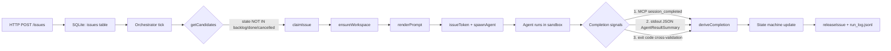

# nano-symphony 本地回路快速上手

[English](./SKILL.md)

## 概览

nano-symphony 是一个轻量级编排服务，将本地 Bun/TypeScript 后端与 SQLite、MCP 服务器以及在沙箱中运行的真实 agent 子进程(nano 或 claude-code)组合在一起。核心循环是:

```
tick → claim issue → spawn agent → collect stdout JSON + MCP events → update state machine
```

本 skill 提供从零到看到一次完整 agent 运行成功结束的最短路径，并附带常见阻塞问题的排查指南。

**不在范围内:** 远程部署、前端 dashboard 定制、自定义 MCP 工具开发、生产级沙箱调优。

## 前置条件

- **Bun >= 1.x** — 用 `bun --version` 验证
- **真实的 nano 二进制** — 在 `PATH` 上，或通过 `NANO_BIN=/absolute/path/nano` 显式指定
- **macOS**(默认:sandbox-exec)或 **Linux**(默认:bwrap)
- 使用 claude-code agent 时:已安装并完成认证的 `claude` CLI

## 快速上手

按以下顺序从零运行一个最小 demo:

### 1. 克隆并初始化

```bash
git clone https://github.com/nano-harness/nano-symphony.git
cd nano-symphony
./scripts/init-project.sh
# This creates .env from .env.example and runs bun install
```

### 2. 创建工作流配置

```bash
cp templates/WORKFLOW.example.md WORKFLOW.md
```

示例工作流已经带有合理的默认值:
- `agent.binary: nano`
- `agent.timeout_ms: 300000`(5 分钟)
- `agent.max_retries: 3`
- `agent.sandbox.backend: native`(macOS 上为 sandbox-exec,Linux 上为 bwrap)
- `agent.sandbox.network_access: true`(MCP 回调所必需)

### 3. 启动服务

```bash
bun run start
```

默认情况下，服务监听 **4123 端口** 并启动 orchestrator 循环。你应该能看到表明以下事项的日志行:
- HTTP 服务器已启动
- MCP 服务器已挂载在 `/mcp`
- Orchestrator tick 已开始

开发期间如需更详细的日志:

```bash
LOG_LEVEL=debug bun run start
```

### 4. 导出 API Token

所有 `/api/v1/*` 端点(`/api/v1/health` 除外)都需要认证。从 `.env` 导出一次 token,并在下面的每条 `curl` 命令中复用:

```bash
TOKEN=$(grep '^API_TOKEN=' .env | cut -d= -f2-)
```

该 token 由 `init-project.sh` 自动生成。随时可用 `grep API_TOKEN .env` 查看。

### 5. 创建 demo issue

**关键:** 使用 `state: "todo"` 或 `state: "in_progress"`,不要用 `state: "backlog"`。orchestrator 的候选 SQL 默认会过滤掉 backlog 状态的 issue。

```bash
curl -X POST http://localhost:4123/api/v1/issues \
  -H "X-Symphony-Token: ${TOKEN}" \
  -H 'Content-Type: application/json' \
  -d '{
    "title": "echo hello world",
    "description": "Print hello world and exit successfully",
    "priority": "medium",
    "state": "todo"
  }'
```

orchestrator 会在下一个 tick(默认 5 秒，见 `ORCHESTRATOR_TICK_MS`)内拾取该 issue。

### 6. 观察事件

获取事件时间线以查看进度:

```bash
curl -s -H "X-Symphony-Token: ${TOKEN}" http://localhost:4123/api/v1/events | jq '.[] | {ts, kind, message}'
```

预期的事件序列:
1. `started` — Orchestrator 已 claim 该 issue 并 spawn 了 agent
2. `goal_state_observed` — Agent 报告了目标状态(如果使用了 goal evaluator)
3. `sandbox_observed` — 沙箱元数据已记录
4. `session_completed` — Agent 调用了 `symphony.session_completed` MCP 工具
5. `completed` / `handoff` / `abandoned` — 基于 agent 结果的最终状态

也可以通过 SSE 实时流式获取事件:

```bash
curl -N -H "X-Symphony-Token: ${TOKEN}" http://localhost:4123/api/v1/events/stream
```

### 7. 查看 agent 日志

agent 的 stdout/stderr 会被捕获到 workspace 中:

```bash
ls workspaces/DEMO-1/logs/
tail -50 workspaces/DEMO-1/logs/attempt-0.log
```

运行结果是 stdout 中最后一个匹配 `AgentResultSummary` schema 的 JSON 行:

```json
{"status":"success","reason":"task completed","goal_state":{"last_reason":"hello world printed"},"tokens":{"input":1200,"output":350}}
```

### 8. 验证最终状态

```bash
curl -s -H "X-Symphony-Token: ${TOKEN}" http://localhost:4123/api/v1/issues/$(curl -s -H "X-Symphony-Token: ${TOKEN}" http://localhost:4123/api/v1/issues | jq -r '.[0].id') | jq '{state, updated_at}'
```

issue 应根据你的工作流 `state_transitions` 配置转移到 `done`、`in_review` 或 `cancelled`(默认:`success -> done`、`abandoned -> cancelled`、`handoff -> in_review`)。

### 9. 检查健康状态

```bash
curl -s http://localhost:4123/api/v1/health | jq
```

返回 orchestrator 状态、在途 agent 数量、队列深度和运行时长。

## 架构速览



**完成信号优先级:** MCP `session_completed` 语义覆盖 stdout payload;退出码用于交叉校验(success + 非零退出码 = 降级为 needs_retry)。

**Agent 集成方式:** 默认情况下 agent 通过 `symphony` CLI 报告完成(`symphony fetch-issue`、`symphony emit-result`、`symphony session-completed`)。这是推荐路径，因为它在所有运行时中都可用。MCP JSON-RPC 仅在运行时无法执行 shell 命令时使用。设置 `agent.transport: cli`(默认)可确保不注入 MCP 配置;仅当 agent 确实需要 MCP 配置时才使用 `mcp` 或 `auto`。

**输出目录:** agent 产物写入 `<workspace>/.nano-out/`(对 nano agent 而言包含 `result.json` 和 `solution.patch`)。

## Claude Code Agent

要使用 Claude Code 而不是 nano:

```bash
curl -X POST http://localhost:4123/api/v1/issues \
  -H "X-Symphony-Token: ${TOKEN}" \
  -H 'Content-Type: application/json' \
  -d '{
    "title": "add a hello function",
    "description": "Add a hello() function to main.ts",
    "priority": "medium",
    "state": "todo",
    "agent_kind": "claude-code"
  }'
```

关键差异:
- 使用 `claude -p --output-format stream-json` 而不是 `nano binary exec`
- token 用量从 envelope 级别的 `usage` 字段提取(权威数据，而非自报数据)
- 不会产出 `solution.patch` — 使用 `collectWorkspaceDiff` 获取 diff
- 权限模式默认为 `acceptEdits`
- MCP 配置写入 `.mcp.json`(而非 `.nano/nano.yaml`)

## 运维工作流

### 在运行期间添加评论

```bash
curl -X POST http://localhost:4123/api/v1/issues/<ID>/comments \
  -H "X-Symphony-Token: ${TOKEN}" \
  -H 'Content-Type: application/json' \
  -d '{"body": "Focus on the edge case where input is empty", "author": "alice"}'
```

评论会自动注入到下一次 attempt 的 prompt 中。

### 取消正在运行的 agent

```bash
curl -X POST -H "X-Symphony-Token: ${TOKEN}" http://localhost:4123/api/v1/runs/<ISSUE_ID>/cancel
```

向 agent 进程发送 SIGTERM,3 秒后发送 SIGKILL。

### handoff 后请求修改

```bash
curl -X POST http://localhost:4123/api/v1/issues/<ID>/request-changes \
  -H "X-Symphony-Token: ${TOKEN}" \
  -H 'Content-Type: application/json' \
  -d '{"note": "Tests are failing, please fix the edge case"}'
```

将 issue 回退到 `todo`,并将备注注入下一次 attempt 的 prompt。

### 重新触发已完成/已放弃的 issue

```bash
curl -X POST http://localhost:4123/api/v1/issues/<ID>/retrigger \
  -H "X-Symphony-Token: ${TOKEN}" \
  -H 'Content-Type: application/json' \
  -d '{"target_state": "todo", "reset_blocker_fingerprint": true, "note": "Try again with updated context"}'
```

### 批准 handoff

```bash
curl -X POST http://localhost:4123/api/v1/issues/<ID>/approve \
  -H "X-Symphony-Token: ${TOKEN}" \
  -H 'Content-Type: application/json' \
  -d '{"note": "Looks good, merging"}'
```

## 运行日志

每个完成的 worker 运行都会向 `run_log.jsonl` 追加一条结构化 JSON 行:

```json
{"schema_version":1,"issue_id":"abc","identifier":"DEMO-1","attempt":0,"started_at":"...","finished_at":"...","duration_ms":12000,"semantics":"success","target_state":"done","success":true,"blocker_fingerprint":null,"termination_cause":null,"tokens":{"input":5000,"output":1200,"total":6200},"events_url":"/api/v1/issues/abc/events"}
```

可用于 agent 性能的批量分析、成本追踪和调试。

## WORKFLOW.md 关键字段参考

| 配置段 | 字段 | 默认值 | 说明 |
|---------|-------|---------|-------------|
| `agent` | `kind` | `nano` | Agent 类型:`nano` 或 `claude-code` |
| `agent` | `binary` | `nano` | agent 可执行文件的路径或名称 |
| `agent` | `timeout_ms` | `3600000` | 强杀前的最长运行时间(1 小时) |
| `agent` | `max_retries` | `3` | 放弃前的最大重试次数 |
| `agent` | `permission_mode` | `auto` | 权限模式:`default`、`acceptEdits`、`plan`、`auto`、`yolo` |
| `agent.sandbox` | `backend` | `native` | `native`(sandbox-exec/bwrap)、`docker` 或 `none` |
| `agent.sandbox` | `network_access` | `true` | 允许 agent 的 shell 发起网络请求 |
| `agent.sandbox` | `extra_read_only_paths` | `[]` | agent 可额外读取的路径 |
| `agent.sandbox` | `extra_writable_paths` | `[]` | agent 可额外写入的路径 |
| `agent.sandbox` | `extra_denied_paths` | `[]` | 显式拒绝访问的路径 |
| `goal` | `condition` | (必填) | 自然语言目标描述 |
| `goal` | `max_turns` | `50` | 中止前的最大 agent 轮数 |
| `goal` | `inject_mode` | `prefix` | 目标注入方式:`prefix`、`system`、`none` |
| `retry` | `base_delay_ms` | `5000` | 初始退避延迟 |
| `retry` | `max_delay_ms` | `300000` | 最大退避延迟 |
| `state_transitions` | `success` | `done` | 成功时的目标状态 |
| `state_transitions` | `abandoned` | `cancelled` | 放弃时的目标状态 |
| `state_transitions` | `handoff` | `in_review` | handoff 时的目标状态 |

## 最小 demo(macOS arm64 + 原生沙箱)

以下是在 macOS 上验证过的完整可复制粘贴序列:

```bash
# 0. Prerequisites
cd nano-symphony
./scripts/init-project.sh
cp templates/WORKFLOW.example.md WORKFLOW.md
command -v nano && nano --version  # Must see real nano binary

# 1. Start service in background
LOG_LEVEL=debug bun run start > /tmp/symphony.out 2>&1 &
SYM_PID=$!
sleep 3

# 2. Verify service is up (/health is auth-exempt)
curl -fsS http://localhost:4123/api/v1/health | jq '.status'
# Expected: "ok"

# 2.5. Export API token for authenticated requests
TOKEN=$(grep '^API_TOKEN=' .env | cut -d= -f2-)

# 3. Create a todo issue (NOT backlog)
curl -X POST http://localhost:4123/api/v1/issues \
  -H "X-Symphony-Token: ${TOKEN}" \
  -H 'Content-Type: application/json' \
  -d '{
    "title": "echo hello",
    "description": "Just say hi and exit",
    "priority": "medium",
    "state": "todo"
  }'

# 4. Wait for orchestrator tick + agent run
sleep 10

# 5. Check events
curl -s -H "X-Symphony-Token: ${TOKEN}" http://localhost:4123/api/v1/events | jq -r '.[] | "\(.ts) \(.kind) \(.message)"'

# 6. Check logs
ls workspaces/DEMO-1/logs/
tail -50 workspaces/DEMO-1/logs/attempt-0.log

# 7. Verify final state
curl -s -H "X-Symphony-Token: ${TOKEN}" http://localhost:4123/api/v1/issues | jq -r '.[0] | {identifier, state, updated_at}'

# 8. Check run log
tail -1 run_log.jsonl | jq

# 9. Cleanup
kill $SYM_PID
```

**通过标准:**
1. 事件包含 `started` -> `session_completed` 或 `completed`
2. `attempt-0.log` 包含以 AgentResultSummary JSON 行结尾的 agent 输出
3. issue 状态从 `todo` 转移到 `done`/`in_review`/`cancelled`(不卡在 `todo`)
4. `run_log.jsonl` 有一行 `"success": true` 且 `tokens` 非 null

## 验证与观察

### 查看活跃运行

```bash
curl -s -H "X-Symphony-Token: ${TOKEN}" http://localhost:4123/api/v1/runs | jq
```

### 流式获取事件(SSE)

```bash
curl -N -H "X-Symphony-Token: ${TOKEN}" http://localhost:4123/api/v1/events/stream
```

### 流式获取 agent 日志(SSE)

```bash
curl -N -H "X-Symphony-Token: ${TOKEN}" http://localhost:4123/api/v1/logs/<ISSUE_ID>/current
```

### 查询指定 issue

```bash
curl -s -H "X-Symphony-Token: ${TOKEN}" http://localhost:4123/api/v1/issues/<ISSUE_ID> | jq
```

## 故障排查

| 症状 | 根因 | 修复 |
|---------|-----------|------|
| 任何 API 调用返回 `{"error":"Unauthorized"}` / HTTP 401 | `X-Symphony-Token` 请求头缺失或 token 错误 | 导出 token:`TOKEN=$(grep '^API_TOKEN=' .env \| cut -d= -f2-)`,然后给每条 `curl` 命令加上 `-H "X-Symphony-Token: ${TOKEN}"`。`/api/v1/health` 是唯一豁免的端点。 |
| issue 已创建但始终收不到 `started` 事件 | `state=backlog` 被候选 SQL 过滤 | 用 `state: "todo"` 或 `state: "in_progress"` 创建 |
| `started` 之后立即 `abandoned`(退出码 1) | 找不到二进制或沙箱拒绝 | 查看 `attempt-N.log` 中的错误;确认 `nano` 在 PATH 上 |
| agent 报告成功但 symphony 记录为 `needs_retry` | 尽管 payload 为 success，退出码却是非零 | 检查 agent 清理阶段是否崩溃;修复 agent 的退出逻辑 |
| agent 运行正常却出现 `no_result_payload` 事件 | agent 的 stdout 没有以合法 JSON 行结尾 | 查看 `attempt-N.log` 的最后几行;确认 JSON schema 与 `AgentResultSummary` 匹配 |
| 重启后 issue 卡在 `claimed` | 非干净关闭留下了残留行 | Symphony 启动时会自动恢复(v0.8+);或手动执行:`UPDATE symphony_runs SET last_state='released' WHERE last_state='claimed'` |
| 卡在 `retry_queued`,永不重跑 | `next_due_ts` 未到，或已超出 max_retries | 查看 `symphony_runs` 表;用 retrigger API 重置 |
| sandbox-exec: "Operation not permitted" | 默认沙箱只允许写 workspace 和 `/tmp` | 在 WORKFLOW.md 中把该路径加入 `agent.sandbox.extra_writable_paths` |
| MCP 回调返回 401/403 | token 未传递或已过期 | 检查 `.nano.yaml` 中是否有 `X-Symphony-Token` 请求头和 `MCP_TOKEN_TTL_MS` |
| token 用量始终为 null(claude-code) | 旧版 symphony 未提取 envelope.usage | 升级到 v0.8+;确认 `parseResult` 从 envelope 提取 |
| SSE 流返回 503 | 同时存在的 SSE 连接过多(上限 50) | 关闭未使用的浏览器标签页 / SSE 客户端 |
| plan run 卡在 `awaiting_approval` | 等待人工批准 dry_run_summary | 调用 `POST /api/v1/plan-runs/<id>/approve` — 或用 `POST /api/v1/plan-runs/<id>/reject {"reason":"..."}` 拒绝 |
| plan run 脚本失败 / dry_run 失败 | 脚本错误、超时或超出 max_issues | 查看 `${SYMPHONY_DATA}/plan-runs/<id>/journal.jsonl` 中 `type="error"` 的条目;同时检查服务的 stderr |
| 调用方 issue 无限期卡在 `awaiting_plan` | plan run 已到终态，但 `tickFinalizedPlans` 尚未恢复调用方 | 等待一个 orchestrator tick(默认 5 秒);若仍卡住，检查调用方 issue 的 `symphony_events` 中是否有 `caller_resumed` 事件 |

## 常见错误

1. **用 `state: "backlog"` 创建 issue 并期望自动运行**
   Backlog 状态的 issue 不会被 `getCandidates` SQL 选中。
   请使用 `state: "todo"`,或调用 `symphony.activate_issue` 将其移出 backlog。

2. **以为任何二进制在不支持 `binary exec --sandbox=on` 的情况下也能工作**
   旧版本的 nano 或非 nano 二进制会静默失败或忽略沙箱。
   验证你的二进制支持 sandbox 子命令:`nano binary exec --help`。

3. **为了"快速调试"而禁用沙箱(`backend: none`)**
   Agent 将获得宿主机机密、SSH 密钥和敏感环境变量的访问权。
   即使在开发环境也请使用 `backend: native`;仅在受控实验中禁用。

4. **设置 `state_transitions.success: null` 后疑惑为什么 issue 永远到不了 `done`**
   `null` 表示"不做转移",issue 将永远停留在当前状态。
   请设置为 `"done"` 或其他终态。

5. **用 `tail -f` 跟错了 attempt 编号**
   attempt 从 0 开始计数;只跑了 attempt-0 时 `tail -f attempt-1.log` 什么都看不到。
   先执行 `ls workspaces/<identifier>/logs/` 确认存在哪些 attempt。

6. **期望 claude-code agent 产出 `solution.patch`**
   只有 nano 适配器会向 `--output-dir` 写入 `solution.patch`。
   对 claude-code,请用 workspace 的 git diff 查看变更。

7. **调试时不查看 run_log.jsonl**
   `run_log.jsonl` 包含结构化的逐 attempt 数据(token、耗时、semantics)。
   用 `tail -5 run_log.jsonl | jq` 查看最近的运行。

## 另请参阅

- [skills/nano-symphony/SKILL.md](../nano-symphony/SKILL.md) — Symphony workspace 内的 agent 行为契约(MCP 工具用法)
- [README.md](../../README.md) — 完整 HTTP API 参考、沙箱细节、配置选项
- [templates/WORKFLOW.example.md](../../templates/WORKFLOW.example.md) — 带注释的入门工作流
